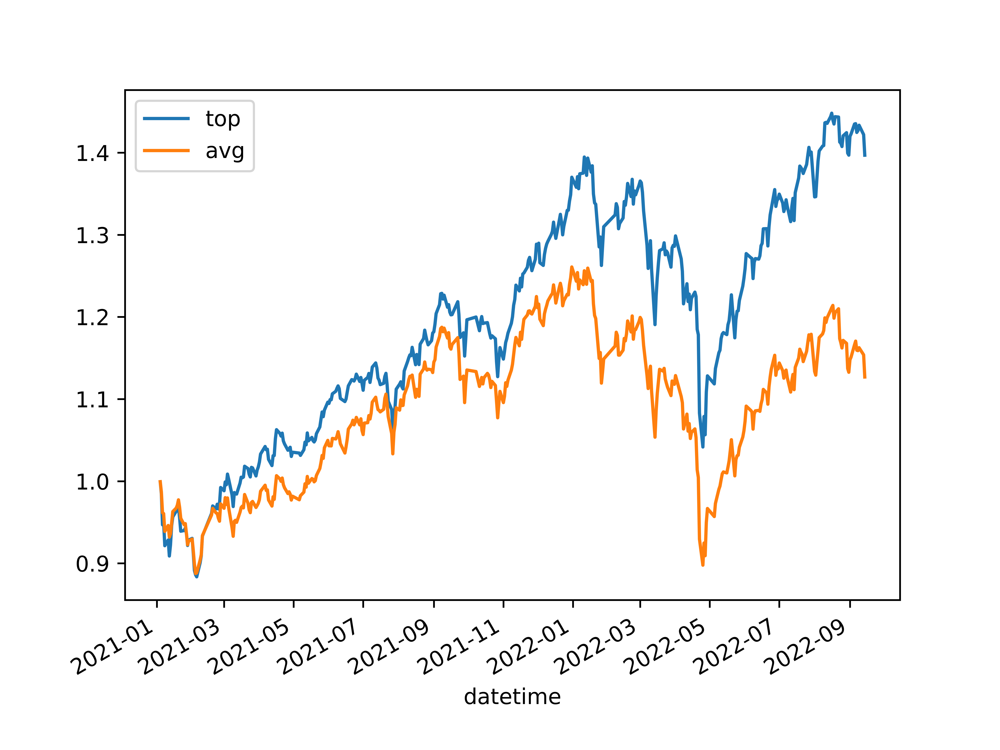

# Demo Alpha Strategy Using ML

This repository is for demo and instruction purpose only. 

## Environment Setup

The following packages are required:

```bash
pandas
numpy
lightgbm
```

### Data

Download [daily stock data](https://cuhko365-my.sharepoint.com/:x:/r/personal/118020043_link_cuhk_edu_cn/Documents/DataHouse/DataHouse_Public/AShareEODPrices.csv?d=w5d2c7aabeb48498fae0dde90b2624d24&csf=1&web=1&e=ee4wLt). In this demo, only price and volume information is used.

## How to Run

In this demo, a GBDT on raw price and volume info is used to predict future price.

```bash
python run_lgb.py --data <path-to-downloaded-daily-price-csv>
```

## Backtest

In this demo, transaction fee is not considered and trades are assumed to be settle on close price.

